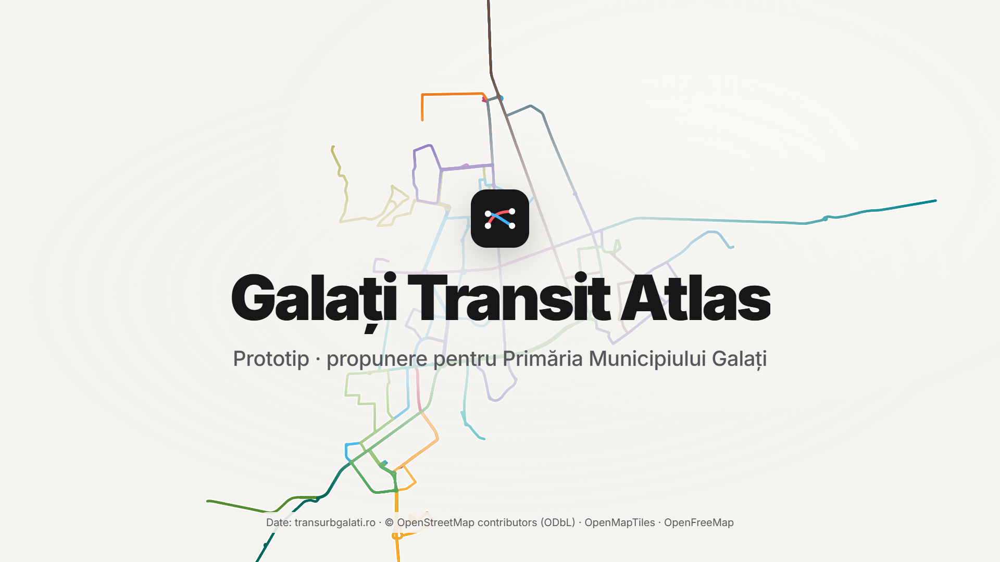

# Galați Transit Atlas

[](https://github.com/WhiteDragonul/galati-transit/actions/workflows/ci.yml)
[](LICENSE)

**Hartă 3D interactivă, open source, a transportului public din Galați:** toate cele 30 de linii Transurb (autobuz, troleibuz, tramvai), stațiile pe tur și retur și orarul oficial al fiecărei stații, cu următoarea plecare.

**[Deschide aplicația →](https://whitedragonul.github.io/galati-transit/)**



- **Harta**: toată rețeaua, pe o hartă 3D a orașului, cu fiecare linie în culoarea ei.
- **Liniile**: alegi o linie și vezi traseul, stațiile în ordine pe tur și retur și capetele.
- **Orarele**: orarul oficial pentru fiecare stație (luni–vineri / weekend) și următoarea plecare.
- **Pe telefon**: gândită în primul rând pentru telefon, fără instalare.
- **Date verificate**: datele se compară automat cu site-ul operatorului. Ce lipsește sau e calculat este marcat clar.

Este un **prototip independent**, nu o aplicație oficială TRANSURB S.A. sau a Primăriei Galați.

## Licență și date

- **Cod**: [MIT](LICENSE). Îl poți folosi, modifica și redistribui liber.
- **Date**: nu sunt sub MIT. Traseele și pozițiile vin din © OpenStreetMap contributors (ODbL). Liniile, stațiile oficiale și orarele vin de pe transurbgalati.ro (© TRANSURB S.A.). Detalii în [DATA_LICENSES.md](DATA_LICENSES.md).

Contribuțiile sunt binevenite: deschide un issue sau un pull request. Cea mai utilă contribuție pentru date e direct în [OpenStreetMap](https://www.openstreetmap.org/): de exemplu, adăugarea relațiilor pentru liniile 1 și 2.

## Cerințe

Node.js 20+ (testat pe 24). Toate comenzile merg în PowerShell, cmd sau bash.

```powershell
npm install
npm run dev        # http://localhost:5173
```

## Interfață

- **Hartă**: MapLibre GL JS, stil OpenFreeMap Positron, clădiri 3D (`fill-extrusion`) de la zoom 12.
- **Panou**: pe desktop e în stânga; pe telefon (sub 768 px) devine un bottom sheet cu trei poziții, tras cu degetul.
- **Link direct** către o linie: `/#linie=bus-9` (id-urile sunt în `public/data/lines.json`).
- **Linii cu date incomplete**: traseu punctat pe hartă, eticheta „incomplet” în listă și un bloc explicativ în detaliu, cu link spre relația OSM.
- **Culori**: OSM nu are culori pentru liniile din Galați, deci UI-ul folosește o paletă de rezervă, marcată ca atare. Culorile oficiale se pun în `overrides.json`.

### Motion design

Toate duratele și curbele sunt centralizate în `src/motion/tokens.ts`, iar animațiile DOM folosesc biblioteca [`motion`](https://motion.dev).

| Moment | Ce se întâmplă |
|---|---|
| Intro | camera coboară din vederea de sus într-o vedere înclinată (52°); liniile apar treptat, panoul intră, rândurile listei apar pe rând |
| Selecție linie | celelalte linii se estompează; camera zboară spre traseu; traseul se desenează progresiv în sensul de mers, iar stațiile apar pe măsură ce linia ajunge la ele |
| După desenare | un puls luminos parcurge traseul în buclă (`line-gradient` + `line-progress`, fără deck.gl) |
| Tur / retur | indicatorul segmentat alunecă cu resort, iar stațiile intră pe rând |
| Telefon | sheet cu fizică de resort și inerție la eliberare |

`prefers-reduced-motion` dezactivează toate animațiile: camera sare direct, iar traseul apare complet.

### Capturi de ecran

```powershell
npm run dev                   # într-un terminal
npm run snapshot              # în altul: capturi desktop + telefon în snapshots/, prin Edge instalat
```

`BROWSER_CHANNEL=chrome` folosește Chrome în loc de Edge.

## Date

Sunt două surse, fiecare folosită pentru ce are mai bun:

| Sursă | Ce dă |
|---|---|
| **transurbgalati.ro** (programul de circulație) | lista oficială de linii, stațiile în ordine pe tur/retur, variantele de serviciu (ex. weekend spre Grădina Publică) și **orarul fiecărei stații** (luni–vineri / weekend și sărbători) |
| **OpenStreetMap** (Overpass) | desenul traseelor și pozițiile stațiilor pe hartă |

Stațiile oficiale sunt legate de stațiile OSM prin potrivirea numelor, în ordine (`scripts/lib/match.ts`, cu teste).
O stație fără corespondent sigur rămâne **fără poziție** și apare marcată în aplicație și în raport. Nu e plasată aproximativ.

```powershell
npm run data:fetch            # OSM → data/raw/osm-YYYY-MM-DD.json
npm run data:fetch-roads      # străzile din Galați (OSM) → data/raw/roads-YYYY-MM-DD.json
npm run data:fetch-transurb   # site Transurb → data/raw/transurb-YYYY-MM-DD.json (~960 pagini, 3 cereri simultan, cu cache)
npm run data:build            # → public/data/* (+ schedules/<linie>.json) și data/report.md
npm run data:verify           # verificări + comparație cu site-ul live → data/verify.md
npm run data                  # toate
npm test                      # teste pentru potrivirea numelor de stații
```

**Linii pe care OSM nu le are** (de ex. liniile noi 1 și 2): traseul e calculat pe rețeaua de străzi OSM (`scripts/lib/router.ts`, Dijkstra).
Calculul respectă sensurile unice, preferă străzile pe care circulă deja transport public și trece prin stațiile oficiale, în ordine.
În aplicație, aceste linii au nota „traseu calculat”. `data:verify` verifică:
- că fiecare stație e la cel mult 60 m de traseu;
- că traseul nu e mai lung de 1,6 × linia dreaptă dintre stații.

Stațiile cu nume ambiguu (care există în mai multe locuri din oraș) sunt alese după poziția pe drum, între stațiile vecine.
Corespondențele confirmate manual (de ex. acronime diferite) se trec în `stopAliases` din `overrides.json`.

`data:fetch-transurb` păstrează paginile de orar în `data/raw/transurb-cache/`, ignorat de git. O rulare repetată descarcă doar lista de linii și paginile de traseu (31 de cereri). Cu `-- --refresh`, re-descarcă tot.

`data:verify` verifică:
- liniile, stațiile și orele din aplicație față de sursa brută (toate);
- lista de linii și stațiile fiecărei linii față de site-ul live (toate);
- orarele față de site-ul live, pe un eșantion de stații.

Opțiuni: `-- --all` verifică orarele tuturor stațiilor live, `-- --sample=N` alege mărimea eșantionului, `-- --offline` sare peste comparația live. Codul de ieșire e diferit de 0 dacă ceva nu corespunde.

Orarul de weekend se aplică și în sărbătorile legale, conform site-ului. Aplicația nu cunoaște calendarul sărbătorilor, deci în acele zile arată orarul de luni–vineri.

### Fluxul datelor

```
OSM (scripts/sources/osm.ts) ──┐
                               ├→ model intern (shared/model.ts)
Transurb (scripts/sources/transurb.ts) ┘   ← Transurb dă liniile/stațiile/orarele, OSM geometria
  → data/overrides.json
  → verificări de calitate (scripts/lib/quality.ts)
  → public/data/lines.json, routes.geojson, stops.geojson + data/report.md
```

Frontendul citește doar `public/data/*` și tipurile din `shared/model.ts`. O sursă nouă, cum ar fi GTFS, trebuie doar să producă același `SourceResult` (`scripts/lib/types.ts`).

### Fișiere generate

| Fișier | Conținut |
|---|---|
| `public/data/lines.json` | linii → variante (tur/retur), stații ordonate, `issues[]` pentru afișarea „date incomplete” |
| `public/data/routes.geojson` | geometria fiecărei variante (`LineString` sau `MultiLineString` dacă traseul e întrerupt) |
| `public/data/stops.geojson` | stații (platforme), cu `lineIds` și `groupId` (același nume la < 300 m, ex. cele două sensuri) |
| `data/report.md` | raport de calitate: trasee rupte, variante fără stații, sensuri lipsă, rute excluse |

Nimic nu e completat din presupuneri. Golurile din trasee rămân goluri, iar culorile lipsă rămân `null`.

### Corecții manuale: `data/overrides.json`

```json
{
  "includeNetworks": ["Transurb"],
  "lines":    { "bus-9":       { "colour": "#d62828", "name": "Autobuz 9", "hidden": false } },
  "variants": { "osm:r395899": { "direction": "retur", "hidden": true } },
  "stops":    { "osm:n123":    { "name": "Nume corectat" } }
}
```

- `includeNetworks`: valorile tag-urilor `network=`/`operator=` incluse. Pentru microbuzele suburbane, adaugă de ex. `"Tegaltrans"`.
- Id-urile de linii, variante și stații se iau din `lines.json`, `stops.geojson` sau din raport.
- Override-urile aplicate apar listate la finalul `report.md`.

Cea mai bună corecție rămâne una făcută direct în OpenStreetMap: repari acolo, apoi rulezi `npm run data`.
